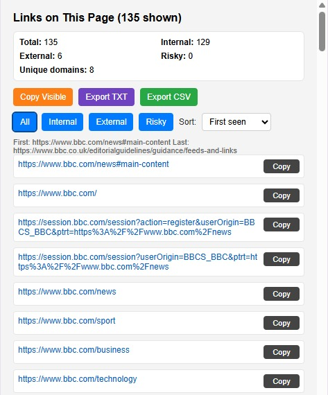
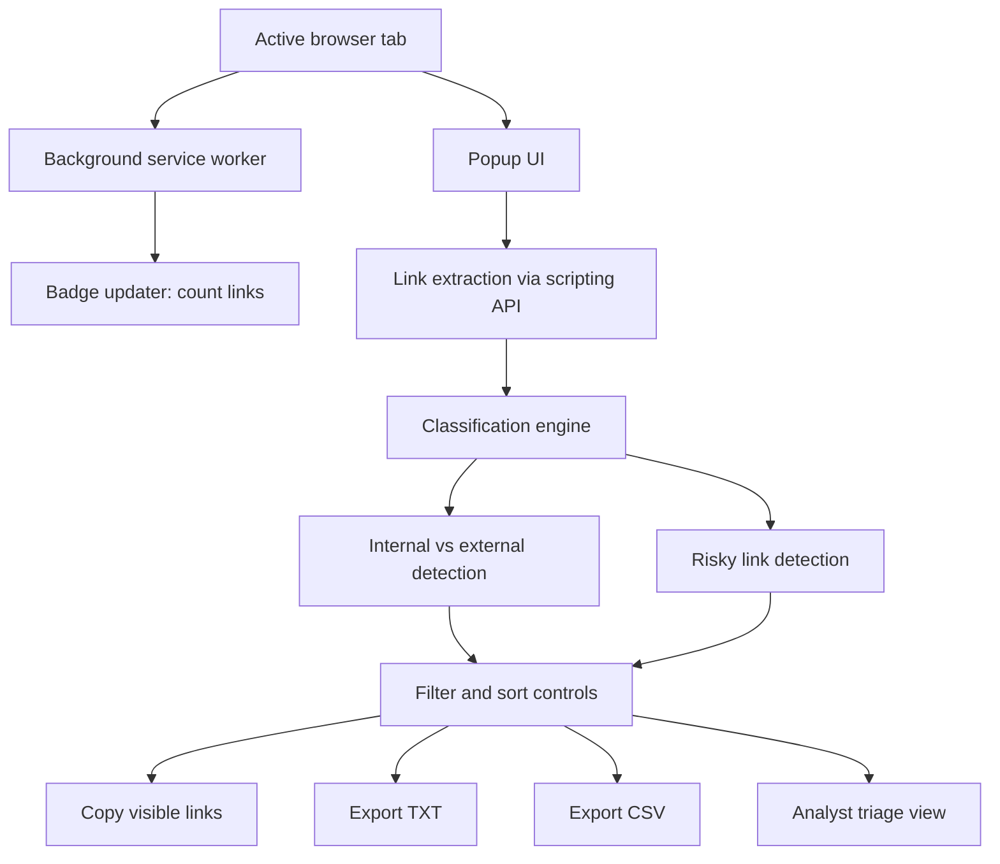

# Link Inspector Chrome Extension

Link Inspector is a lightweight Chrome extension for fast link triage on the active tab.

It extracts unique links, highlights external and risky links, and exports clean evidence for analyst workflows.

## Why this tool exists

During web investigations, analysts often need to:
- quickly enumerate links on a page
- identify external destinations
- spot risky link patterns fast
- export results for case notes

Link Inspector keeps that flow fast inside the browser.

## Features

- Live badge on extension icon showing the current tab link count
- Extracts unique links from the active page
- Internal and external classification (external links highlighted)
- Risky link highlighting for:
  - insecure `http://` links
  - non-web schemes such as `javascript:`, `data:`, `mailto:`, and similar
- Summary panel with:
  - total links
  - internal links
  - external links
  - risky links
  - unique domains
- Filters:
  - All
  - Internal
  - External
  - Risky
- Sorting:
  - First seen
  - Alphabetical
  - Domain
  - Path length
- Copy single link or copy visible filtered list
- Export visible filtered list as TXT or CSV
- Local-only processing, no outbound telemetry

## Screenshot



## Architecture



## Threat patterns this helps identify

- Suspicious external redirection chains hidden in content pages
- Insecure HTTP links that can weaken trust or downgrade transport security
- Non-web or script-style schemes that can signal malicious or unsafe link behaviour
- Large link farms or unexpected domain spread on compromised or spammed pages
- Potential phishing surface where external and risky links cluster together

## Chrome Web Store

https://chromewebstore.google.com/detail/link-inspector/mhddppopjnmclolaonnimfenhfepjmpd

## Installation

### Option 1: Chrome Web Store

Install directly from:
https://chromewebstore.google.com/detail/link-inspector/mhddppopjnmclolaonnimfenhfepjmpd

### Option 2: Load unpacked (developer)

1. Clone or download this repository
2. Open Chrome and go to `chrome://extensions/`
3. Enable **Developer mode**
4. Click **Load unpacked**
5. Select the `src` folder

## Packaging note for store uploads

The extension package root must be the `src` folder contents so that `manifest.json` is at the ZIP root.

Example:

```bash
cd src
zip -r ../link-inspector-upload.zip .
```

Do not upload the repository root as the extension bundle.

## Project structure

```text
README.md
src/
├── manifest.json
├── background.js
├── popup.html
├── popup.js
└── images/
    └── icon128.png
```

## Permissions

- `activeTab`: reads links from the active tab when requested
- `scripting`: runs extraction/count logic in tab context
- `tabs`: updates badge count when active tab changes
- `host_permissions` (`<all_urls>`): enables badge link counting across standard web pages

## Security model

- No data is sent to external services by the extension.
- URLs are rendered with safe DOM APIs, avoiding risky HTML injection patterns.
- Clipboard and export actions are user-triggered.

## Troubleshooting

- **No links found**: page may be script-rendered post-load or has no anchor tags.
- **Cannot run on protected pages**: Chrome blocks script injection on some internal/system pages.
- **Store upload rejects package**: ensure `manifest.json` is at ZIP root, not nested.

## License

Apache License 2.0
